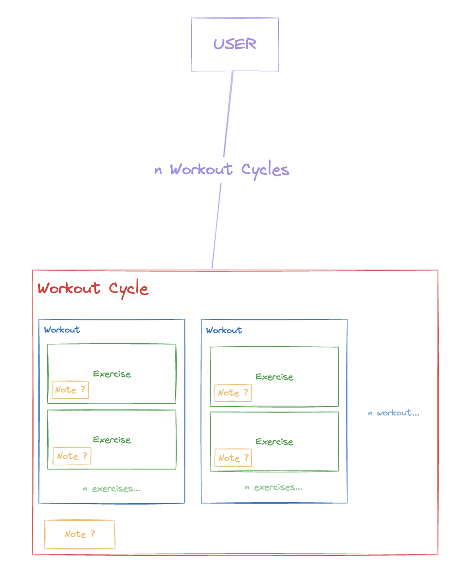
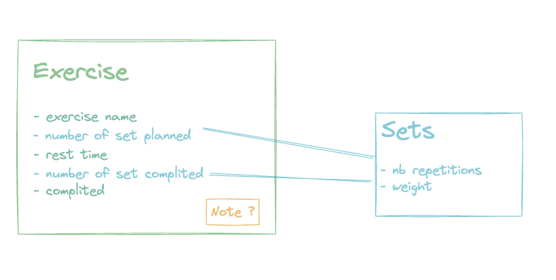

# Step Forward backend

## Description

This app as for goal to improve my skills as a full-stack developer, with a compilation of good behaviors, github projects, pull-requests, unit tests.

Im also adding Devops feature like github workflow, containerization, maybe jenkins pipeline in the future as well as some plays with kubernetes to learn new stuff, everything will than be hosted in a serverless environnement when finished.

The backend of stepfoward app in [Nest](https://github.com/nestjs/nest) framework TypeScript starter repository.

## setup the project
rename then .env.example to .env should do the trick (you can customize it as wished)

## install dependencies

```bash
$ npm install
```

## run the project

```bash
$ docker compose up -d --build
```

## Run tests

```bash
# unit tests
$ npm run test

# e2e tests
#$ npm run test:e2e comming soon

# test coverage
$ npm run test:cov
```

## How does it work



Each user can have multiple workout cycles, with multiple workouts, that contains exercises were you plan the number of sets you want to do and upon completion, writing your actual performances with notes on everything

You can than get the total weight lifted, see your progress on exercise, between similar workouts .etc.

## Resources

Check out a few resources that may come in handy when working with NestJS:

- Visit the [NestJS Documentation](https://docs.nestjs.com) to learn more about the framework.
- For questions and support, please visit our [Discord channel](https://discord.gg/G7Qnnhy).
- To dive deeper and get more hands-on experience, check out our official video [courses](https://courses.nestjs.com/).
- Deploy your application to AWS with the help of [NestJS Mau](https://mau.nestjs.com) in just a few clicks.
- Visualize your application graph and interact with the NestJS application in real-time using [NestJS Devtools](https://devtools.nestjs.com).
- Need help with your project (part-time to full-time)? Check out our official [enterprise support](https://enterprise.nestjs.com).
- To stay in the loop and get updates, follow us on [X](https://x.com/nestframework) and [LinkedIn](https://linkedin.com/company/nestjs).
- Looking for a job, or have a job to offer? Check out our official [Jobs board](https://jobs.nestjs.com).
